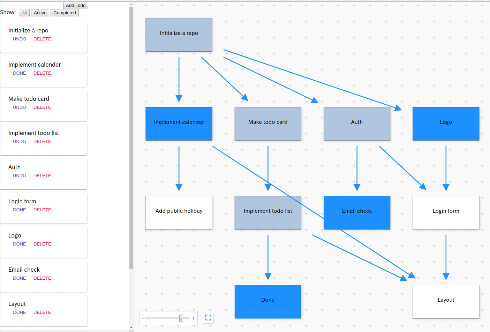

[Site](https://todo.clelia-house.tokyo/)

**This is an incomplete sample**

It is a simple TodoList with dependency expressed by DAG

### How to use
1. Add some todos
2. Add an arrow by dragging with shift-key from todo to todo
3. Remove an arrow by dragging with shift-key from connected todo to todo
4. If you complete a todo, click it to change state done.
